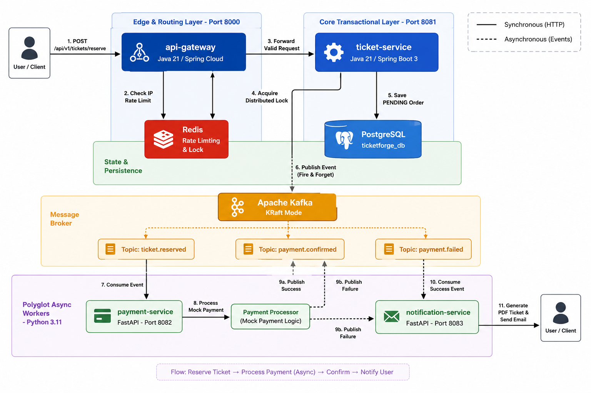
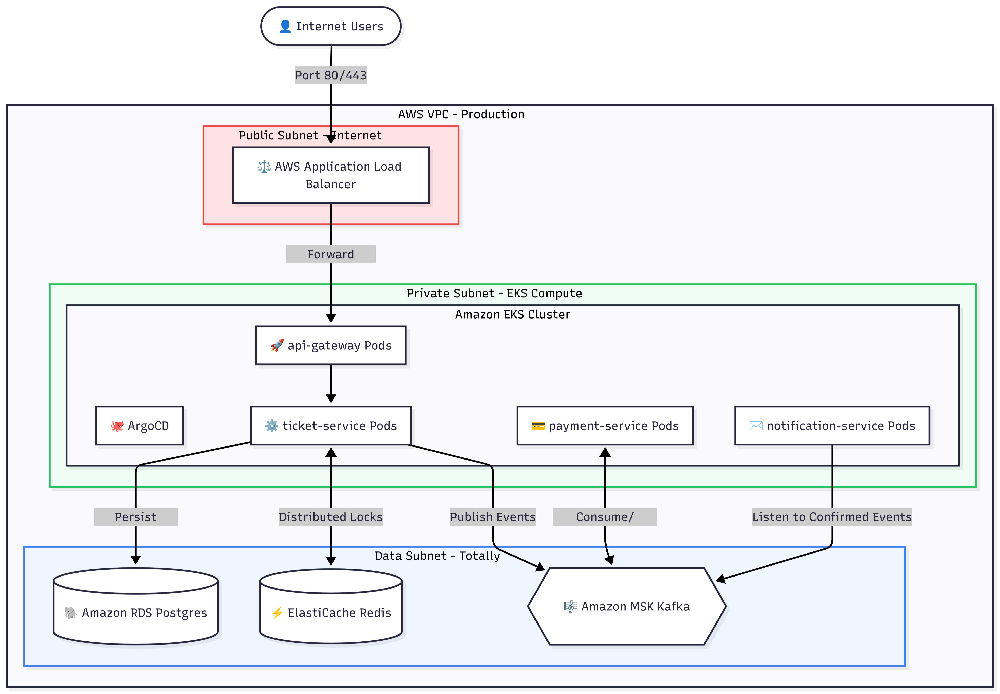
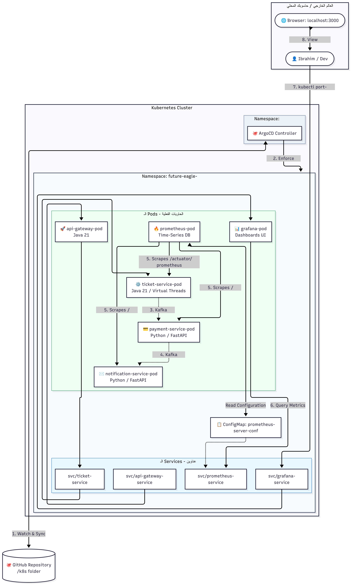
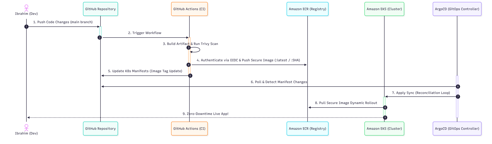

# 🎟️ TicketForge

### Production-Grade Event-Driven Microservices Platform

A cloud-native, event-driven microservices architecture designed as a real-world sandbox for mastering advanced **Cloud Engineering**, **DevSecOps**, and **Distributed Systems** patterns. TicketForge simulates a high-traffic ticketing platform — concert flash sales, match-day rushes — to solve critical challenges in **scalability**, **concurrency control**, and **resilient cloud infrastructure**.

<p align="center">
  <a href="https://openjdk.org/projects/jdk/21/"></a>
  <a href="https://spring.io/projects/spring-boot"></a>
  <a href="https://www.python.org/"></a>
  <a href="https://fastapi.tiangolo.com/"></a>
  <a href="https://kafka.apache.org/"></a>
  <a href="https://www.postgresql.org/"></a>
  <a href="https://redis.io/"></a>
  <a href="https://docs.docker.com/compose/"></a>
  <a href="https://aws.amazon.com/eks/"></a>
  <a href="https://www.terraform.io/"></a>
  <a href="https://argoproj.github.io/cd/"></a>
  <a href="LICENSE"></a>
</p>

---

## 📐 System Architecture

> **Flow:** `Reserve Ticket → Process Payment (Async) → Confirm → Notify User`

The platform follows a fully **event-driven architecture** where services communicate asynchronously through Apache Kafka topics, ensuring loose coupling and independent scalability.

<p align="center">
  
</p>

### How It Works (Step-by-Step)

| Step | Action | Component |
|:----:|--------|-----------|
| 1 | User sends `POST /api/v1/tickets/reserve` | Client |
| 2 | IP-based rate limiting check | API Gateway + Redis |
| 3 | Request forwarded to downstream service | API Gateway → Ticket Service |
| 4 | Distributed lock acquired (`SETNX` with TTL) | Ticket Service + Redis |
| 5 | `PENDING` order persisted to database | Ticket Service + PostgreSQL |
| 6 | `ticket.reserved` event published (fire & forget) | Ticket Service → Kafka |
| 7 | Payment worker consumes reservation event | Payment Service ← Kafka |
| 8 | Mock payment logic executed | Payment Service |
| 9a | On success → publishes `payment.confirmed` | Payment Service → Kafka |
| 9b | On failure → publishes `payment.failed` | Payment Service → Kafka |
| 10 | Notification worker consumes confirmation | Notification Service ← Kafka |
| 11 | PDF ticket generated & email simulated | Notification Service → User |

---

## 🧩 Service Breakdown

### `api-gateway` — Edge & Routing Layer

| | |
|---|---|
| **Language** | Java 21 / Spring Cloud Gateway |
| **Port** | `8000` |
| **Responsibilities** | Request routing, IP-based rate limiting via Redis, health monitoring |
| **Key Tech** | Spring Cloud Gateway, Redis Reactive, Micrometer/Prometheus |

The gateway acts as the single entry point, enforcing **per-IP rate limiting** (10 req/s sustained, 20 burst) using Redis-backed token buckets before forwarding valid requests downstream.

---

### `ticket-service` — Core Transactional Engine

| | |
|---|---|
| **Language** | Java 21 / Spring Boot 4.1 (Virtual Threads enabled) |
| **Port** | `8081` |
| **Responsibilities** | Seat reservation, distributed locking, event publishing |
| **Key Tech** | Spring Data JPA, Spring Data Redis, Spring Kafka, Lombok |

The heart of the platform. Uses **Redis distributed locks** (`SETNX` with 5-minute TTL) to prevent double-booking under high concurrency, persists orders to PostgreSQL, and publishes reservation events to Kafka asynchronously.

---

### `payment-service` — Async Payment Processor

| | |
|---|---|
| **Language** | Python 3.11 / FastAPI |
| **Port** | `8082` |
| **Responsibilities** | Consume reservation events, process payments, emit confirmation/failure events |
| **Key Tech** | AIOKafka (async consumer/producer), Prometheus instrumentation |

A background Kafka worker that consumes `ticket.reserved` events, simulates payment processing (mock logic where every 7th order fails), and publishes results to either `payment.confirmed` or `payment.failed` topics.

---

### `notification-service` — PDF Generation & Notification Delivery

| | |
|---|---|
| **Language** | Python 3.11 / FastAPI |
| **Port** | `8083` |
| **Responsibilities** | Listen for confirmed payments, generate PDF tickets, simulate email delivery |
| **Key Tech** | AIOKafka, FPDF2 (PDF generation), Prometheus instrumentation |

Listens for `payment.confirmed` events, generates a branded PDF ticket (with order ID, user ID, match ID, seat number), and simulates email delivery to the user.

---

## 🏗️ Infrastructure

### Local Development — Docker Compose

A single `docker-compose.yml` orchestrates the full backing-services stack for local development:

| Service | Image | Port | Purpose |
|---------|-------|------|---------|
| **PostgreSQL** | `postgres:latest` | `5432` | Transactional data store for ticket orders |
| **Redis** | `redis:7-alpine` | `6379` | Distributed locks + API Gateway rate limiting |
| **Apache Kafka** | `confluentinc/cp-kafka:7.5.0` | `9092` | Event broker (KRaft mode — no ZooKeeper) |
| **Kafka UI** | `provectuslabs/kafka-ui:latest` | `8080` | Visual monitoring for topics & consumer groups |

```bash
# Spin up the entire infrastructure
docker compose up -d

# Verify all services are healthy
docker compose ps
```

---

### Cloud Production — AWS (Terraform + EKS)

The production environment is fully provisioned as **Infrastructure as Code** using Terraform modules targeting AWS:

<p align="center">
  
</p>

| Resource | Terraform Module | Configuration |
|----------|-----------------|---------------|
| **VPC** | `terraform-aws-modules/vpc/aws` | `10.0.0.0/16` CIDR, 2 AZs (`eu-west-1a/b`), public + private + database subnets |
| **EKS Cluster** | `terraform-aws-modules/eks/aws` | K8s 1.28, 1–5 `t3.medium` ON_DEMAND nodes |
| **RDS PostgreSQL** | `aws_db_instance` | PostgreSQL 15.4, `db.t3.micro`, auto-scaling to 100GB, isolated in database subnet |
| **ECR Registries** | `aws_ecr_repository` | 4 repositories (one per service), scan-on-push enabled, KMS encryption |

```bash
# Preview the infrastructure plan
cd terraform
terraform init && terraform plan

# Apply (requires AWS credentials)
terraform apply -var="db_password=YOUR_SECURE_PASSWORD"
```

---

## ☸️ Kubernetes Cluster Topology

All services run inside an EKS cluster under the `future-eagle-prod` namespace, orchestrated by ArgoCD for GitOps-driven deployments:

<p align="center">
  
</p>

| Manifest | Kind | Highlights |
|----------|------|------------|
| `ticket-service.yaml` | Deployment + Service | 2 replicas, resource limits (256–512Mi), readiness probe on `/actuator/health`, `ClusterIP` |
| `api-gateway.yaml` | Deployment + Service | 2 replicas, Redis env injection, readiness probe, `ClusterIP` |
| `notification-service.yaml` | Deployment + Service | Downstream event worker |
| `payment-service.yaml` | Deployment + Service | Downstream event worker |
| `prometheus.yaml` | ConfigMap + Deployment + Service | Scrapes Spring Boot (`/actuator/prometheus`) and FastAPI (`/metrics`) endpoints |
| `grafana.yaml` | Deployment + Service | Dashboards UI on port `3000` |
| `argocd-app.yaml` | ArgoCD Application | Auto-sync with prune + self-heal from `k8s/` directory |

---

## 🔄 CI/CD Pipeline — DevSecOps

The end-to-end delivery pipeline follows a **GitOps** model: code push triggers CI, which builds, scans, and pushes secure images — then ArgoCD auto-syncs the cluster.

<p align="center">
  
</p>

### `ticket-service-ci.yml` — Java/Spring Boot Pipeline (AWS ECR)

```
Push to main → Checkout → Setup JDK 21 → Maven Build → OIDC Auth to AWS
→ ECR Login → Docker Build & Tag (:SHA + :latest) → Trivy Scan (CRITICAL/HIGH)
→ Push to Amazon ECR
```

- **Authentication:** Passwordless via GitHub OIDC → AWS IAM Role (no stored secrets)
- **Security Gate:** Trivy blocks deployment if CRITICAL or HIGH vulnerabilities are found
- **Tagging:** Dual-tagged with commit SHA (traceability) and `latest` (convenience)

### `payment-service-ci.yml` — Python/FastAPI Pipeline (Docker Hub)

```
Push/PR to master → Checkout → Setup Python 3.11 → pip install → Flake8 Lint
→ Docker Buildx → Trivy Scan (CRITICAL/HIGH) → Push to Docker Hub
```

- **Lint Gate:** `flake8` catches syntax errors and undefined names before build
- **Security Gate:** Trivy scans the built image for critical vulnerabilities
- **Registry:** Docker Hub (`future-eagle-iot/payment-service`)

---

## 📊 Observability Stack

All services expose Prometheus-compatible metrics, scraped by a centralized Prometheus instance and visualized through Grafana dashboards:

| Service | Metrics Endpoint | Instrumentation |
|---------|-----------------|-----------------|
| `api-gateway` | `/actuator/prometheus` | Micrometer Registry Prometheus |
| `ticket-service` | `/actuator/prometheus` | Micrometer Registry Prometheus |
| `payment-service` | `/metrics` | `prometheus-fastapi-instrumentator` |
| `notification-service` | `/metrics` | `prometheus-fastapi-instrumentator` |

---

## 🔐 Security Practices (DevSecOps)

| Layer | Practice |
|-------|----------|
| **Containers** | Multi-stage Docker builds, non-root users (`ticketuser`, `gwuser`, `appuser`) |
| **CI/CD** | Trivy vulnerability scanning as a blocking gate, Flake8 linting |
| **AWS Auth** | GitHub OIDC federation — no long-lived AWS credentials |
| **Registry** | ECR scan-on-push + KMS encryption at rest |
| **Network** | VPC subnet isolation (public / private / database), RDS accessible only from EKS security group |
| **Secrets** | Terraform `sensitive` variables, K8s environment injection |

---

## 📁 Project Structure

```
ticket-forge-devops/
├── .github/workflows/          # CI/CD pipelines
│   ├── ticket-service-ci.yml   #   Java → AWS ECR pipeline
│   └── payment-service-ci.yml  #   Python → Docker Hub pipeline
├── apigateway/                 # Spring Cloud Gateway (Java 21)
│   ├── Dockerfile              #   Multi-stage build (Maven → JRE 21 Alpine)
│   ├── pom.xml                 #   Spring Cloud Gateway, Redis Reactive, Actuator
│   └── src/                    #   Gateway config & rate limiter bean
├── ticket-service/             # Core Booking Engine (Java 21)
│   ├── Dockerfile              #   Multi-stage build with non-root user
│   ├── pom.xml                 #   JPA, Redis, Kafka, Prometheus
│   └── src/                    #   Controller, Service, Model, Repository
├── payment-service/            # Async Payment Worker (Python 3.11)
│   ├── Dockerfile              #   Multi-stage build (pip → slim runtime)
│   ├── main.py                 #   Kafka consumer/producer with mock payment logic
│   └── requirements.txt        #   FastAPI, AIOKafka, Prometheus
├── notification-service/       # PDF & Email Worker (Python 3.11)
│   ├── Dockerfile              #   Multi-stage build with non-root user
│   ├── main.py                 #   Kafka consumer, PDF generation (FPDF2)
│   └── requirements.txt        #   FastAPI, AIOKafka, FPDF2, Prometheus
├── k8s/                        # Kubernetes manifests
│   ├── ticket-service.yaml     #   Deployment + ClusterIP Service
│   ├── api-gateway.yaml        #   Deployment + ClusterIP Service
│   ├── payment-service.yaml    #   Deployment + Service
│   ├── notification-service.yaml#  Deployment + Service
│   ├── prometheus.yaml         #   ConfigMap + Deployment + Service
│   ├── grafana.yaml            #   Deployment + Service
│   └── argocd-app.yaml         #   GitOps Application (auto-sync)
├── terraform/                  # AWS Infrastructure as Code
│   ├── provider.tf             #   AWS provider (eu-west-1) + default tags
│   ├── vpc.tf                  #   VPC with public/private/database subnets
│   ├── eks.tf                  #   EKS cluster with managed node groups
│   ├── rds.tf                  #   PostgreSQL RDS with security group
│   └── ecr.tf                  #   ECR repositories for all 4 services
├── docs/                       # Architecture diagrams
├── docker-compose.yml          # Local infrastructure stack
├── LICENSE                     # Apache License 2.0
└── README.md                   # ← You are here
```

---

## 🚀 Quick Start

### Prerequisites

- **Docker** & **Docker Compose** v2+
- **Java 21** (for building ticket-service and api-gateway)
- **Python 3.11** (for running payment and notification services locally)
- **Maven 3.9+**

### 1. Start Infrastructure

```bash
docker compose up -d
```

### 2. Build & Run Ticket Service

```bash
cd ticket-service
mvn clean package -DskipTests
java -jar target/ticket-service-0.0.1-SNAPSHOT.jar
```

### 3. Build & Run API Gateway

```bash
cd apigateway
mvn clean package -DskipTests
java -jar target/api-gateway-0.0.1-SNAPSHOT.jar
```

### 4. Run Payment Service

```bash
cd payment-service
pip install -r requirements.txt
uvicorn main:app --host 0.0.0.0 --port 8082
```

### 5. Run Notification Service

```bash
cd notification-service
pip install -r requirements.txt
uvicorn main:app --host 0.0.0.0 --port 8083
```

### 6. Test a Reservation

```bash
curl -X POST "http://localhost:8000/api/v1/tickets/reserve?userId=user42&matchId=MATCH_001&seatNumber=A-15"
```

---

## 🗺️ Roadmap

- [ ] Implement Saga pattern for distributed transaction rollback
- [ ] Add Spring Security + JWT authentication to API Gateway
- [ ] Integrate AWS ElastiCache (managed Redis) and Amazon MSK (managed Kafka)
- [ ] Helm charts for templated K8s deployments
- [ ] Load testing with k6 / Gatling for flash-sale simulation
- [ ] Distributed tracing with OpenTelemetry + Jaeger
- [ ] Dead letter queue handling for failed events

---

## 📄 License

This project is licensed under the **Apache License 2.0** — see the [LICENSE](LICENSE) file for details.

---

<div align="center">
  <sub>Built with ☕ Java 21, 🐍 Python 3.11, and a passion for Cloud-Native Engineering</sub>
</div>
